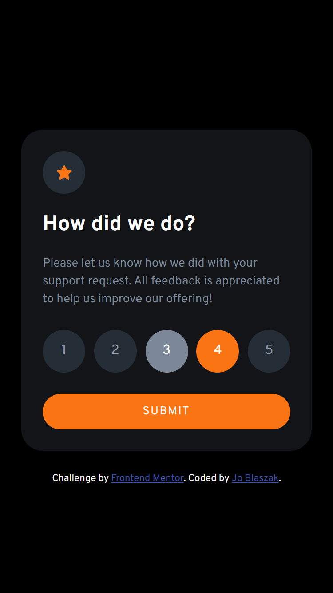
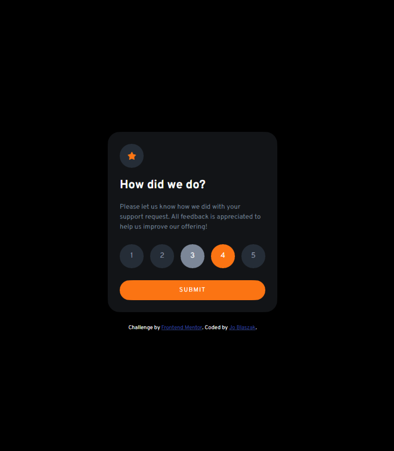

# Frontend Mentor - Interactive rating component solution

This is a solution to the [Interactive rating component challenge on Frontend Mentor](https://www.frontendmentor.io/challenges/interactive-rating-component-koxpeBUmI). Frontend Mentor challenges help you improve your coding skills by building realistic projects. 

## Table of contents

  - [Overview](#overview)
    - [Screenshot](#screenshot)
    - [Links](#links)
  - [My process](#my-process)
    - [Built with](#built-with)
    - [What I learned](#what-i-learned)
  - [Author](#author)
  - [Acknowledgements](#acknowledgements)

## Overview

### Screenshot

### Links

- Solution URL: [https://github.com/jblaszak/practice/tree/main/frontendmentor/level-one/interactive-rating-component-main](https://github.com/jblaszak/practice/tree/main/frontendmentor/level-one/interactive-rating-component-main)
- Live Site URL: [https://jblaszak.github.io/practice/frontendmentor/level-one/interactive-rating-component-main/index.html](https://jblaszak.github.io/practice/frontendmentor/level-one/interactive-rating-component-main/index.html)

## My process

### Built with

- Semantic HTML5 markup
- CSS custom properties
- Flexbox
- Vanilla Javascript

### What I learned

Learned more about DOM manipulation with javascript and styling radio buttons!  Also implemented some more semantic tags and aria labels. Had some challenges with positioning of text a lower baseline, could set more padding but that is inconsistent when there's more than one line. Will need to find a better solution to this.

## Author

- Frontend Mentor - [@jblaszak](https://www.frontendmentor.io/profile/jblaszak)
- Twitter - [@jblaszak](https://www.twitter.com/jblaszak)

## Acknowledgements
