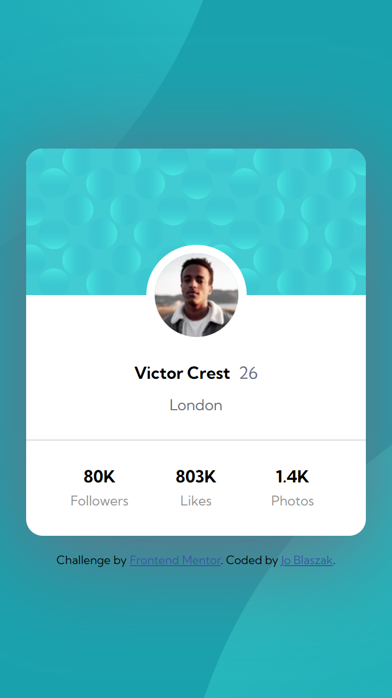

# Frontend Mentor - Profile card component solution

This is a solution to the [Profile card component challenge on Frontend Mentor](https://www.frontendmentor.io/challenges/profile-card-component-cfArpWshJ). Frontend Mentor challenges help you improve your coding skills by building realistic projects.

## Table of contents

- [Frontend Mentor - Profile card component solution](#frontend-mentor---profile-card-component-solution)
  - [Table of contents](#table-of-contents)
  - [Overview](#overview)
    - [Screenshot](#screenshot)
    - [Links](#links)
  - [My process](#my-process)
    - [Built with](#built-with)
    - [What I learned](#what-i-learned)
  - [Author](#author)
  - [Acknowledgements](#acknowledgements)

## Overview

### Screenshot




### Links

- Solution URL: [https://github.com/jblaszak/practice/tree/main/frontendmentor/level-one/profile-card-component-main](https://github.com/jblaszak/practice/tree/main/frontendmentor/level-one/profile-card-component-main)
- Live Site URL: [https://jblaszak.github.io/practice/frontendmentor/level-one/profile-card-component-main/index.html](https://jblaszak.github.io/practice/frontendmentor/level-one/profile-card-component-main/index.html)

## My process

### Built with

- Semantic HTML5 markup
- CSS custom properties
- CSS Grid
- CSS Flexbox

### What I learned

This was a fun one. Using multiple backgrounds was new for me. It was more involved/challenging than the previous components, which was nice!
Had to use transformsfor position and box shadows as well! Had difficulty with the overall page background positioning. Looked at some other solutions for it and found a way that worked. Also learned that
the CSS reset for img's was messing up the expected behaviour! Had to reset this to 'initial'!

```css
img {
  max-width: 100%;
}
```

## Author

- Frontend Mentor - [@jblaszak](https://www.frontendmentor.io/profile/jblaszak)
- Twitter - [@jo_blaszak](https://www.twitter.com/jo_blaszak)

## Acknowledgements
