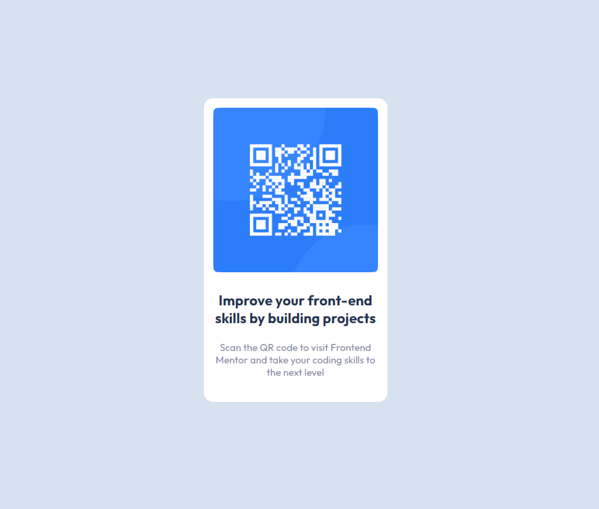

# Frontend Mentor - QR code component solution

This is a solution to the [QR code component challenge on Frontend Mentor](https://www.frontendmentor.io/challenges/qr-code-component-iux_sIO_H). Frontend Mentor challenges help you improve your coding skills by building realistic projects.

## Table of contents

- [Frontend Mentor - QR code component solution](#frontend-mentor---qr-code-component-solution)
  - [Table of contents](#table-of-contents)
  - [Overview](#overview)
    - [Screenshot](#screenshot)
    - [Links](#links)
  - [My process](#my-process)
    - [Built with](#built-with)
    - [What I learned](#what-i-learned)
  - [Author](#author)
  - [Acknowledgements](#acknowledgements)

## Overview

### Screenshot

### Links

- Solution URL: [https://github.com/jblaszak/practice/tree/main/frontendmentor/level-one/qr-code-component-main](https://github.com/jblaszak/practice/tree/main/frontendmentor/level-one/qr-code-component-main)
- Live Site URL: [https://jblaszak.github.io/practice/frontendmentor/level-one/qr-code-component-main/index.html](https://jblaszak.github.io/practice/frontendmentor/level-one/qr-code-component-main/index.html)

## My process

### Built with

- Semantic HTML5 markup
- CSS custom properties

### What I learned

Challenge was pretty simple, learned a bit more about CSS resets to get the page to show full height. I did it more for time management practice to estimate how long it would take. Spent a little too much time fiddling trying to get sizing right. Would have been much faster with some design files.

## Author

- Frontend Mentor - [@jblaszak](https://www.frontendmentor.io/profile/jblaszak)
- Twitter - [@jo_blaszak](https://www.twitter.com/jo_blaszak)

## Acknowledgements
