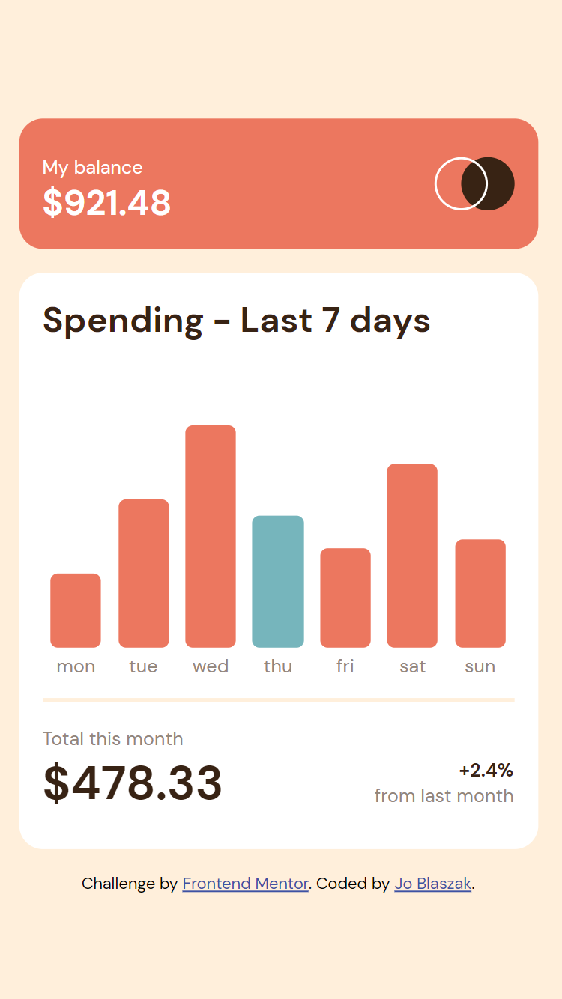
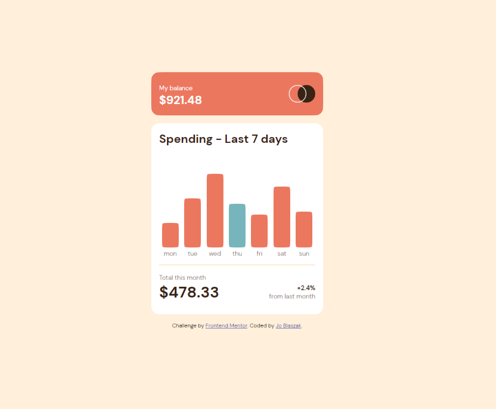

# Frontend Mentor - Expenses chart component solution

This is a solution to the [Expenses chart component challenge on Frontend Mentor](https://www.frontendmentor.io/challenges/expenses-chart-component-e7yJBUdjwt). Frontend Mentor challenges help you improve your coding skills by building realistic projects. 

## Table of contents

  - [Overview](#overview)
    - [The Challenge](#the-challenge);
    - [Screenshot](#screenshot)
    - [Links](#links)
  - [My process](#my-process)
    - [Built with](#built-with)
    - [What I learned](#what-i-learned)
  - [Author](#author)
  - [Acknowledgements](#acknowledgements)

## Overview

### The challenge

Users should be able to:

- View the bar chart and hover over the individual bars to see the correct amounts for each day
- See the current day’s bar highlighted in a different colour to the other bars
- View the optimal layout for the content depending on their device’s screen size
- See hover states for all interactive elements on the page
- **Bonus**: Use the JSON data file provided to dynamically size the bars on the chart

### Screenshot

### Links

- Solution URL: [https://github.com/jblaszak/practice/tree/main/frontendmentor/level-one/expenses-chart-component-main](https://github.com/jblaszak/practice/tree/main/frontendmentor/level-one/expenses-chart-component-main)
- Live Site URL: [https://jblaszak.github.io/practice/frontendmentor/level-one/expenses-chart-component-main/index.html](https://jblaszak.github.io/practice/frontendmentor/level-one/expenses-chart-component-main/index.html)

## My process

### Built with

- Semantic HTML5 markup
- CSS custom properties
- Flexbox
- Vanilla Javascript

### What I learned

## Author

- Frontend Mentor - [@jblaszak](https://www.frontendmentor.io/profile/jblaszak)
- Twitter - [@jblaszak](https://www.twitter.com/jblaszak)

## Acknowledgements
